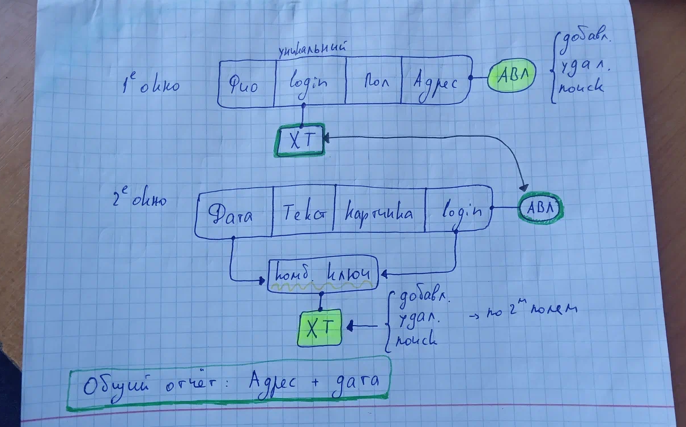

### Это курсовая работа по алгоритмам и структурам данных

Большой проект, в котором нам дали задание использовать все структуры данных, которые мы изучили ранее, и реализовали. Моя реализация работает на АВЛ-дереве, и хеш таблице. Первичная хеш функция - середина квадрата, вторичная использует метод открытой адресации и квадратичную функцию. 

Я взял тему "Сервис знакомств", фактически, это несколько справочников, соединённых вместе, как раз этими структурами данных, и с возможностью добавления, удаления и поиска элементов по указанным полям, а также составление отчёта по всем данным в программе.

---

Важным условием реализации - был полностью оконный интерфейс. Как и многие другие, я использовал Windows Forms на C#, для своей реализации

В результате получился простой и красивый интерфейс, состоящий из множества маленьких, но нужных окошек:

---

Структура связей программы выглядит следующим образом:

Всего в программе есть 2 основных окна:
1. Список всех пользователей
2. Список всех постов

Пользователи хранятся в структуре АВЛ дерева по их адресу, а посты хранятся в хеш-таблице, с комбинированным ключом, состоящим из даты поста и логина пользователя создавшего пост. 

Связка между этими двумя структурами осуществляется при помощи хеш-таблицы и АВЛ дерева, привязанных к логину пользователя. Так можно показать все посты пользователя, потому что логин уникален.

Эта структура на первый взгляд выглядит очень сложной. Да и на второй тоже. Да и по факту она является очень сложной и непонятной 😅  
Но нам спорить не приходилось, дали задание - и нам нужно было его сделать

Суммарное количество строчек кода – более 5,5 тысяч

